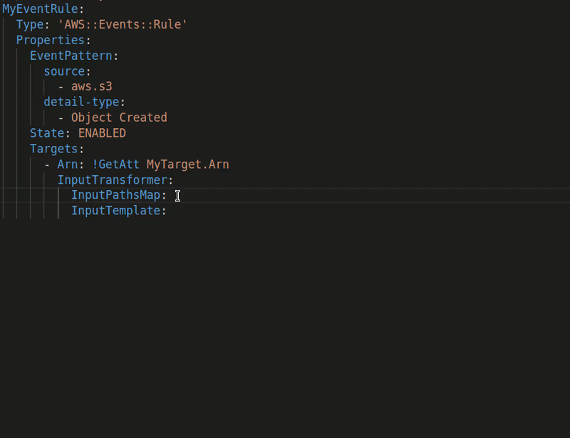

# Eventbridge Assistant

This extension integrates with Amazon EventBridge Schema Registry to provide autocomplete when composing event patterns.

## Usage

### Event pattern auto-complete
When composing EventBridge patterns, place the cursor where you want to insert a property or value and hit `ctrl+space`/`⌃space` to reveal the suggestions. Note that if you have multiple code completion extensions installed, then the result of some of them might end up before the suggestions from this extension.

Note that an EventBridge schema's ID is named after the `source` and `detail-type`, such as `my-source@MyDetailType`. Therefore you will only get suggestions beyond the `detail` property once both `source` and `detail-type` have been provided.

### InputPath and InputTransformer auto-complete
If you have defined a single `source` and `detail-type` in your event pattern you will receive auto-complete when composing `InputPath` and `InputTransformer` configuration.

## Known issues

* It currently only supports YAML templates and the schema registries `aws.events` and `discovered-schemas`

## Unknown issues

There are many ways vscode can be configured and this has been validated on a few of them. That said - there might be unforeseen bugs when parsing the YAML.

If you encounter any issues, please take a moment to report them [here](https://github.com/mhlabs/eventbridge-assistant/issues)

