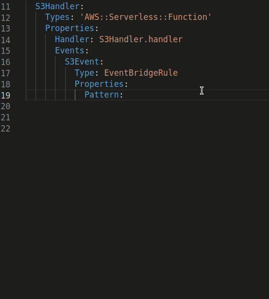

# Eventbridge Assistant

This extension integrates with Amazon EventBridge Schema Registry to provide autocomplete when composing event patterns.

## Known issues

It currently only supports YAML templates and the schema registries `aws.events` and `discovered-schemas`

## Unknown issues

If you encounter any issues, please take a moment to report them [here](https://github.com/mhlabs/eventbridge-assistant/issues)

